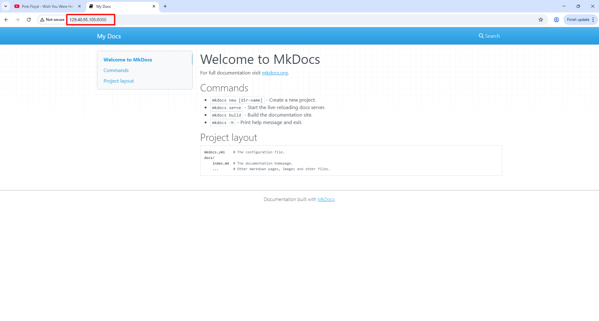
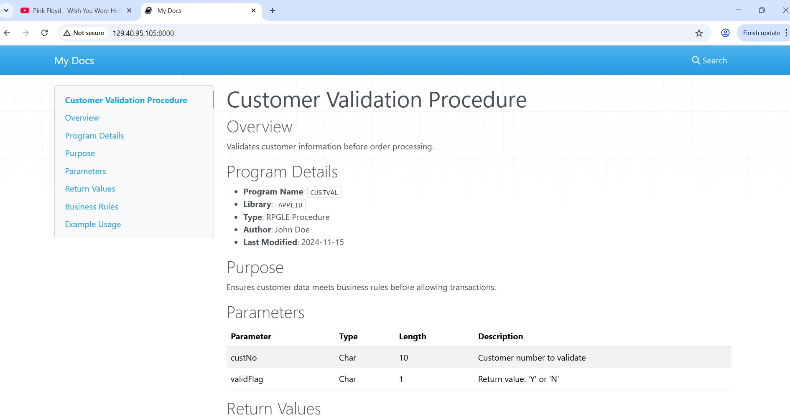

<h1 align="center">Setup MkDocs on IBM i</h1>

<p align="center">A Practical Guide to Modern Documentation on IBM i</p>

---

## 📖 Introduction

This guide will walk you through setting up **MkDocs** - a modern, fast, and beautiful documentation system on your IBM i platform. MkDocs converts simple Markdown files into professional-looking websites, perfect for documenting your IBM i applications, procedures, and systems.

**New to MkDocs?** Read [mkdocs_overview.md](mkdocs_overview.md) first to understand the benefits and use cases.

**What you'll achieve:**
- A live documentation website running on your IBM i
- Easy-to-maintain documentation using Markdown
- No database or complex web server setup required
- Professional appearance with Material Design theme

---

## 📋 Table of Contents

1. [Pre-Requisites](#-pre-requisites)
2. [Installation](#-installation)
3. [Creating Your First MkDocs Project](#-creating-your-first-mkdocs-project)
4. [Understanding the Project Structure](#-understanding-the-project-structure)
5. [Configuring Your Documentation Site](#-configuring-your-documentation-site)
6. [Organizing Your Documentation](#-organizing-your-documentation)
7. [Running the MkDocs Server](#-running-the-mkdocs-server)
8. [IBM i Specific Considerations](#-ibm-i-specific-considerations)
9. [Troubleshooting](#-troubleshooting)
10. [Bonus Sections](#-bonus-sections)
11. [References](#-references)

---

## 🔧 Pre-Requisites

Before installing MkDocs, you need to set up your IBM i environment with the necessary tools.

### 1. Set Your PATH Environment Variable

The PATH variable tells IBM i where to find open-source packages. Add this to your shell profile:

```bash
export PATH=/QOpenSys/pkgs/bin:/QOpenSys/usr/bin:/usr/ccs/bin:/QOpenSys/usr/bin/X11:/usr/sbin:.:/usr/bin
```

**Why?** This ensures your system can locate Python, pip, and other open-source tools installed via yum.

### 2. Install Required Packages

Install the GNU Compiler Collection (gcc) and Python development tools:

```bash
yum install gcc* python3-devel python3-pip -y
```

**What does this install?**
- `gcc*` - Compiler tools needed for building Python packages
- `python3-devel` - Python development headers and libraries
- `python3-pip` - Python package installer

**Why do we need these?** 
Some Python packages (including MkDocs dependencies) need to compile native code, which requires gcc and development headers.

---

## 🚀 Installation

### Why Use a Virtual Environment?

MkDocs requires specific Python packages to function. Installing them system-wide can cause conflicts with other applications. A **virtual environment** creates an isolated "sandbox" where MkDocs and its dependencies can live safely without affecting the rest of your system. So it is good practice to run MKDocs inside a python virtual environment.

### Step 1: Create Project Directory

We will be creating a dedicated directory on the current user's home folder called `mkdocs` for this setup. But you can create a directory anywhere you want. 

```bash
mkdir mkdocs && cd mkdocs
```


### Step 2: Create Python Virtual Environment

Create a virtual environment named `mkpy`:

```bash
python3 -m venv --system-site-packages mkpy
```

**What does the argument --system-site-packages do?** 
It allows the virtual environment to access globally installed Python packages while keeping its own isolated packages.

### Step 3: Activate the Virtual Environment

```bash
source mkpy/bin/activate
```

**You'll know it's activated** when your command prompt shows `(mkpy)` at the beginning.

**Important:** You need to activate this environment every time you want to use MkDocs. To deactivate, simply type `deactivate`.

### Step 4: Upgrade pip

Ensure you have the latest package installer:

```bash
pip3 install --upgrade pip
```

### Step 5: Install MkDocs

```bash
pip3 install mkdocs
```

**Verify installation:**
```bash
mkdocs --version
```

### Step 6: Install Material Theme (Optional but Recommended)

The Material theme provides a modern, professional look:

```bash
pip3 install mkdocs-material
```

**Why Material?** It's the most popular MkDocs theme, used by major projects like FastAPI, Typer, and many others. It includes built-in features like search, mobile responsiveness, and beautiful typography.

---

## 📝 Creating Your First MkDocs Project

### Create a New Project

```bash
mkdocs new docportal
```

This creates a new directory called `docportal` with the following structure:

```
docportal/
├── docs/
│   └── index.md       # Your homepage
└── mkdocs.yml         # Configuration file
```

### Navigate to Your Project

```bash
cd docportal
```

### Preview Your Site

```bash
mkdocs serve --dev-addr=0.0.0.0:8000
```

**Access your site:** Open a browser and navigate to `http://YOUR_IBM_I_IP:8000`

And just like that we published a new website on our IBM i.




**What's happening?** MkDocs starts a live development server that automatically rebuilds your site whenever you save changes to your Markdown files.

---

## 📂 Understanding the Project Structure

A typical MkDocs project looks like this:

```

docportal/
├── docs/                          # All your documentation files go here
│   ├── index.md                   # Homepage (required)
│   ├── user-guide/               # Example: User documentation
│   │   ├── getting-started.md
│   │   └── advanced-features.md
│   ├── api/                      # Example: API documentation
│   │   ├── overview.md
│   │   └── endpoints.md
│   ├── procedures/               # Example: RPG/CL procedures
│   │   ├── order-processing.md
│   │   └── inventory-update.md
│   └── assets/                   # Images, CSS, JavaScript
│       └── images/
│           └── logo.png
└── mkdocs.yml                    # Configuration file
```

**Key Points:**
- `docs/index.md` is your homepage (mandatory)
- Organize content in subdirectories by topic
- All Markdown files in `docs/` become web pages
- Store images and assets in `docs/assets/`

---

## ⚙️ Configuring Your Documentation Site

The `mkdocs.yml` file controls your site's appearance and behavior. Here's a comprehensive example with explanations:

```yaml
# Site Information
site_name: IBM i Documentation Portal
site_description: Technical documentation for our IBM i applications and procedures
site_author: Your Company Name
site_url: https://docs.yourcompany.com  # Optional: Your custom domain

# Theme Configuration
theme:
  name: material  # I prefer material theme. It's sleek and snappy
  palette:
    primary: indigo  # Header color
    accent: indigo   # Link and button color
  features:
    - navigation.tabs        # Top-level sections as tabs
    - navigation.sections    # Group navigation items
    - navigation.expand      # Expand sections by default
    - search.highlight       # Highlight search terms
    - search.share          # Share search results
    - toc.integrate         # Integrate table of contents

# Navigation Structure
nav:
  - Home: index.md
  - User Guide:
      - Getting Started: user-guide/getting-started.md
      - Advanced Features: user-guide/advanced-features.md
  - API Documentation:
      - Overview: api/overview.md
      - Endpoints: api/endpoints.md
  - Procedures:
      - Order Processing: procedures/order-processing.md
      - Inventory Update: procedures/inventory-update.md
  - About: about.md

# Markdown Extensions
markdown_extensions:
  - admonition          # Call-out boxes (notes, warnings, tips)
  - codehilite          # Syntax highlighting for code
  - toc:
      permalink: true   # Add permanent links to headers
  - pymdownx.superfences  # Better code blocks
  - pymdownx.tabbed       # Tabbed content
  - tables              # Table support

# Plugins
plugins:
  - search  # Built-in search functionality

```

**Customize this file** based on your needs. The navigation structure will appear as your site's menu. But ensure to have a proper `.md` file for each page you define in the navigation.

---

## 📚 Organizing Your Documentation

### Documentation Template Examples

#### For RPG Procedure Documentation
```markdown
# Customer Validation Procedure

## Overview
Validates customer information before order processing.

## Program Details
- **Program Name**: `CUSTVAL`
- **Library**: `APPLIB`
- **Type**: RPGLE Procedure
- **Author**: John Doe
- **Last Modified**: 2024-11-15

## Purpose
Ensures customer data meets business rules before allowing transactions.

## Parameters
| Parameter | Type | Length | Description |
|-----------|------|--------|-------------|
| custNo | Char | 10 | Customer number to validate |
| validFlag | Char | 1 | Return value: 'Y' or 'N' |

## Return Values
- `Y` - Customer is valid
- `N` - Customer is invalid

## Business Rules
1. Customer must exist in CUSTMAST file
2. Customer status must be 'A' (Active)
3. Credit limit must be > 0

## Example Usage
```
dcl-pr ValidateCustomer;
  custNo char(10);
  validFlag char(1);
end-pr;

ValidateCustomer(orderCust: isValid);
if isValid = 'Y';
  // Process order
endif;
```

```

Just for illustration purpose, I replaced the content of the `index.md` with the above example. After saving the file, my website got refreshed and it looked like below. 



>How cool is it!

---

## 🌐 Running the MkDocs Server

### For Development/Testing

Start the live development server:

```bash
source /mkdocs/mkpy/bin/activate  # Activate virtual environment
cd /mkdocs/docportal        # Navigate to your project
mkdocs serve --dev-addr=0.0.0.0:8000
```

**Access your site:** `http://YOUR_IBM_I_IP:8000`

**Features:**
- Auto-reloads when you save changes
- Instant preview of your edits
- Built-in search

### Keeping the Server Running After Logout

**Note:** The terminal session needs to be alive for the MKDocs to work. If you close the session, then the website won't work. So, we can make use of the `nohup` command to run the server in the background. After navigating to the docportal folder, run the command:

```bash
nohup mkdocs serve --dev-addr=0.0.0.0:8000 > mkdocs.log 2>&1 &
```

**Check if it's running:**
```bash
ps -ef | grep mkdocs
```

**Stop the server:**
```bash
# Find the process ID from ps command above, then:
kill <PID>
```

**Better approach:** See the [Service Commander](#running-as-a-service-with-service-commander) bonus section for production use.

---

## 🔍 IBM i Specific Considerations

### Multi-Threading Environment Variable

MkDocs runs as a multi-threaded Python application. IBM i requires an environment variable to support this:

```bash
ADDENVVAR ENVVAR(QIBM_MULTI_THREADED) VALUE('Y') LEVEL(*SYS)
```

**Why is this needed?** IBM i's PASE environment needs to know that applications may use multiple threads. Without this setting, Python applications like MkDocs may experience performance issues or unexpected behavior.

**When to set it:** Run this command once on your system. It persists across IPLs.

### IFS Permissions

Ensure your user profile has appropriate permissions to the `/mkdocs` directory:

```bash
# Check permissions
ls -la /mkdocs

# If needed, adjust ownership
chown -R youruser:yourgroup /mkdocs
```

### PATH Considerations

If MkDocs commands aren't found after activation, verify your PATH includes open-source binaries:

```bash
echo $PATH
# Should include: /QOpenSys/pkgs/bin
```

Add to your `.profile` or `.bashrc` if missing:
```bash
export PATH=/QOpenSys/pkgs/bin:$PATH
```

### Port Selection

Choose a port that doesn't conflict with existing services:
- Avoid common ports: 80, 443, 8080
- Recommended range: 8000-9000

---

## 🔧 Troubleshooting

### Common Issues and Solutions

#### Issue: "mkdocs: command not found"
**Cause:** Virtual environment not activated or PATH issue.

**Solution:**
```bash
source /mkdocs/mkpy/bin/activate
# Verify:
which mkdocs
```

#### Issue: "Permission denied" errors
**Cause:** Insufficient IFS permissions.

**Solution:**
```bash
# Check current permissions
ls -la /mkdocs

# Fix ownership if needed
chown -R $USER /mkdocs

# Or chmod if you own it
chmod -R 755 /mkdocs
```

#### Issue: "Address already in use"
**Cause:** Port is already occupied.

**Solution:**
```bash
# Find what's using the port
netstat -an | grep 8000

# Use a different port
mkdocs serve --dev-addr=0.0.0.0:8001
```

#### Issue: "Module not found" errors
**Cause:** Package not installed in virtual environment.

**Solution:**
```bash
# Ensure you're in the virtual environment
source /mkdocs/mkpy/bin/activate

# Reinstall the package
pip3 install mkdocs mkdocs-material
```

#### Issue: Site doesn't reflect changes
**Cause:** Browser caching or server needs restart.

**Solution:**
1. Hard refresh browser (Ctrl+F5 or Cmd+Shift+R)
2. Restart MkDocs server
3. Check that you're editing files in the correct `docs/` directory

#### Issue: Python version conflicts
**Cause:** Multiple Python versions installed.

**Solution:**
```bash
# Use explicit Python version
/QOpenSys/pkgs/bin/python3 -m venv mkpy
```

### Getting Help

- **Built-in Search**: MkDocs includes a search plugin. Once you have documentation, users can search across all pages.
- **Enhanced Search**: For larger documentation sites, consider the [mkdocs-material search plugin](https://squidfunk.github.io/mkdocs-material/setup/setting-up-site-search/) which provides better indexing and search results.

---

## 🎁 Bonus Sections

### Custom Domain Setup

Instead of accessing your documentation via `http://192.168.1.100:8000`, set up a friendly domain name like `docs.mycompany.com`.

#### Prerequisites
- Your IBM i system must have a DNS hostname (e.g., `ibmi.mycompany.com`)
- Access to your DNS management system

#### Steps

1. **Create DNS CNAME Record**
   
   In your DNS management console:
   ```
   Type: CNAME
   Name: docs
   Value: ibmi.mycompany.com
   TTL: 3600
   ```

2. **Configure Reverse Proxy (Optional)**
   
   If you have Apache running on IBM i, you can proxy requests from port 80 to your MkDocs port:
   
   ```apache
   <VirtualHost *:80>
       ServerName docs.mycompany.com
       
       ProxyPreserveHost On
       ProxyPass / http://localhost:8000/
       ProxyPassReverse / http://localhost:8000/
   </VirtualHost>
   ```

3. **Update mkdocs.yml**
   
   ```yaml
   site_url: https://docs.mycompany.com
   ```

4. **Access Your Documentation**
   
   Now you can access your docs at `http://docs.mycompany.com`

**Note:** For HTTPS, you'll need SSL certificates configured in your web server.

---

### Running as a Service with Service Commander

For production environments, you want MkDocs to start automatically and run reliably. Service Commander makes this easy.

#### Install Service Commander

```bash
yum install service-commander -y
```

#### Create Service Configuration

Create a file `/QOpenSys/etc/sc/services/mkdocs.yml`:

```yaml
name: mkdocs
description: MkDocs Documentation Server
executable_path: /QOpenSys/pkgs/bin/bash
args:
  - -c
  - source /mkdocs/mkpy/bin/activate && cd /mkdocs/docportal && mkdocs serve --dev-addr=0.0.0.0:8000
working_directory: /mkdocs/docportal
environment_vars:
  - QIBM_MULTI_THREADED=Y
startup_mode: auto
```

#### Manage the Service

```bash
# Start MKDocs via Service Commander
sc start mkdocs

# Stop MKDocs via Service Commander
sc stop mkdocs

# Check status
sc status mkdocs

# View logs
sc logs mkdocs

# Enable auto-start on system boot
sc enable mkdocs
```

**Benefits:**
- Automatic startup after IPL
- Automatic restart if MkDocs crashes
- Centralized logging
- Easy management commands

---

### Static HTML Alternative

While this guide focuses on running MkDocs as a live server, you can also build static HTML files:

```bash
mkdocs build
```

This creates a `site/` directory with complete HTML files. You can:
- Copy to Apache: `cp -r site/* /www/yoursite/htdocs/`
- Serve from any web server
- Host on external platforms

**Trade-offs:**
- **Pro**: No Python process needed in production
- **Pro**: Faster page loads (pre-built HTML)
- **Con**: Must rebuild after every change (no live preview)
- **Con**: Requires additional web server setup

For most IBM i internal documentation needs, the live server approach is simpler.

---

## 📚 References

- **MkDocs Official Documentation**: [https://www.mkdocs.org](https://www.mkdocs.org)
- **Material Theme Documentation**: [https://squidfunk.github.io/mkdocs-material/](https://squidfunk.github.io/mkdocs-material/)
- **Awesome eyecatchy MkDocs Plugin Catalog**: [https://github.com/mkdocs/catalog](https://github.com/mkdocs/catalog)
- **Markdown Guide**: [https://www.markdownguide.org](https://www.markdownguide.org)
- **Service Commander Documentation**: [https://ibm.github.io/ibmi-oss-docs/service-commander/](https://ibm.github.io/ibmi-oss-docs/service-commander/)


---

## 📝 Quick Reference

### Essential Commands

```bash
# Activate virtual environment
source /mkdocs/mkpy/bin/activate

# Create new project
mkdocs new my-project

# Start development server
mkdocs serve --dev-addr=0.0.0.0:8000

# Build static site
mkdocs build

# Deactivate virtual environment
deactivate
```

### Typical Workflow

1. Activate virtual environment
2. Navigate to your project directory
3. Edit Markdown files in `docs/`
4. Save and preview changes in browser
5. Update `mkdocs.yml` for navigation changes
6. Keep server running with Service Commander for production

---

<p align="center">
  <strong>Happy Documenting! 📖</strong><br>
  Transform your IBM i documentation from outdated to outstanding.
</p>