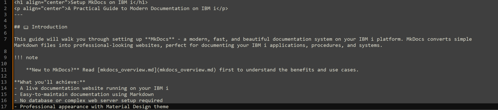
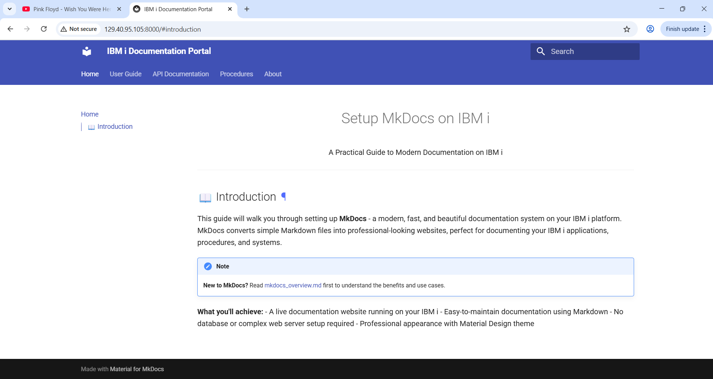

# MKDocs Overview
---

## What is MKDocs?
- **MKDocs** is a **static site generator** specifically designed for building project documentation.
- It takes your **Markdown files** (which are easy to write) and transforms them into a **nice-looking website**.
- Imagine it as a magic wand that turns your plain text into a polished, user-friendly documentation portal.

## Why Should You Care?
- **Simplicity**: MKDocs keeps things straightforward. You write your documentation in Markdown, and it handles the rest. This is what you type. 

And this is what you get



- **Modern Look**: It generates sleek, modern web pages that users will love. 
  You don't have to take my word for it. See for yourself. This [website](https://www.mkdocs.org/user-guide/writing-your-docs/) is created only using MKDocs with simple markdown text content.
- **No Database/Web Server**: No database required. And technically no web server either since the build option creates a static, standalone HTML site.
- **Material Theme**: It uses the Material for MkDocs theme, which makes your documentation look good without any extra effort. This theme is used by popular projects like Typer CLI and FastAPI.

## How Does It Work?
1. You start by writing your documentation in Markdown files.
2. MKDocs then takes these files, processes them, and generates a static website.
3. You can even include code examples, explanations, and links—all neatly organized.

## Steps to Use MKDocs:
Set Up: Install MKDocs (it’s easy, I promise!).
Create Your Docs: Write your documentation in Markdown.
Customize: Adjust settings, choose themes, and make your docs look snazzy.
Build: Run MKDocs to build your documentation.
Too Lazy to build? Don't worry, you can even create a live server and design on the go (like wordpress)
Host: Put your shiny new docs on GitHub Pages or any other hosting service.

## Installation Steps (Overview):
1. Set PATH variable to locate Open-Source packages
```
PATH=/QOpenSys/pkgs/bin:/QOpenSys/usr/bin:/usr/ccs/bin:/QOpenSys/usr/bin/X11:/usr/sbin:.:/usr/bin
export PATH
```
2. Install gcc and python3, and developer packages using the following commands from bash: 
```
yum install gcc*
yum install python3* python3-devel
```
3. Once python is installed, run the below commands one by one. Read the #comments to understand what these commands do.
```bash
mkdir mydoc && cd mydoc #---------------------> Create a new folder called mydoc and navigate to it
python3 -m venv pyfiles #---------------------> Create a new Virtual Environment called pyfiles  
source pyfiles/bin/activate #-----------------> Activate the python Virtual Environment pyfiles
pip3 install mkdocs #-------------------------> Install MKDocs
mkdocs new docproject #-----------------------> Create a new MKDocs project called 'docproject'. A new folder named 'docproject' will be available. 
pip install mkdocs-material #-----------------> Install Material theme for the website
mkdocs serve --dev-addr=129.40.95.65:8558 #---> Serve a live website on the server's IP address with the port# 8558

```


## Why Bother?
- **Good documentation** is essential for any project. Users appreciate clear instructions, examples, and context.
- With MKDocs, you can create professional-looking docs effortlessly.

# Some Use Cases
### 1. Internal Documentation Portal
MKDocs is perfect for creating an internal documentation portal within your organization.

#### Use it to document:
- **Project guidelines**, best practices, and coding standards.
- **System configurations**, setup instructions, and troubleshooting guides.
- **API documentation**, including endpoints, parameters, and examples.


### 2. Knowledge Base for Developers and Administrators:
- MKDocs can serve as a **knowledge base** for developers, system administrators, and support teams.
- Document common issues, solutions, and FAQs.
- Include code snippets, diagrams, and step-by-step instructions.

### 3. Collaborative Documentation Efforts: (For Documenting any application)
- MKDocs allows multiple contributors to work on the same documentation.
- Use Git or other version control systems to collaborate.
- Review, edit, and improve documentation collectively.
- Since MKDocs's documentation are stored in IFS, it is easier to integrate with Git.

**MKDocs simplifies the process of creating static websites, making it an excellent choice for various documentation needs on IBM i. Whether it’s for APIs, SOPs, or cross-team knowledge, MKDocs streamlines information sharing.**


